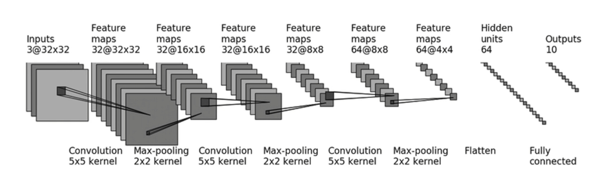

# README

该项目中创建和训练了一个用于CIFAR10分类任务的模型。

数据集地址：https://www.cs.toronto.edu/~kriz/cifar.html 。

该模型的结构如下图所示：

在该模型中，输入图片为3通道、32*32尺寸的图片，
经过第一层卷积层后，处理为32通道的32x32图片， 然后对其进行池化。
这样的方法反复进行三轮后，
将图片展开成64通道的4x4图片，并通过两个Linear层转化为10个不同特征进行输出。

